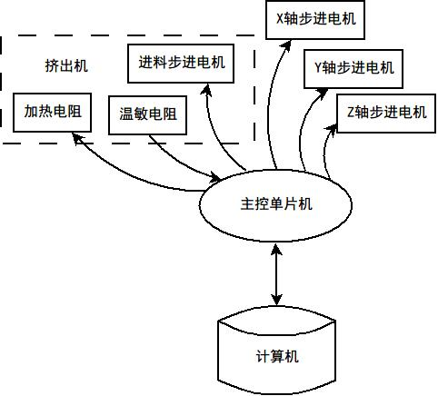

# 电路之路

在一台3D打印机中，电路有什么作用？下面这个系统框图会告诉你。

简单说来，单片机负责控制这几样吧：挤出机的温度、进料与打印的位置。但是最终的指令发出者还是计算机，所以单片机只是计算机指令的执行者。对于3D打印机这样的数控设备来说，这种指令往往是[G代码](http://en.wikipedia.org/wiki/G-code)。

然而光有一只强悍的单片机是不够的。由于挤出机加热电阻（5.6Ω，工作电压12V），以及步进电机总共需要很大电流，所以，电路部分还需要一块很牛逼的电源，使用输出功率300W以上的开关电源、台式电脑电源都可以。

## 方案选择

一般来说，开源社区的方案会有两种。一种是使用专门的Arduino板来做主控，其他模块分别放到别的板子上；另一种是将绝大多数功能集成到同一块电路板上。

开源的电路方案往往会公开原理图和PCB设计图。其实直接用这些PCB上淘宝找师傅做代工，也是可以的，但是PCB代工往往会设“最低消费”，另外在某些需要大电流的地方，PCB的铜导线不够宽也会导致安全隐患。另一种办法是，利用这些图纸自行使用洞洞板焊接，这样会让可以通过的电流大一些，但是工作量会大很多。

这里使用的方案是洞洞板焊接的[Generation 7 Electronics](http://reprap.org/wiki/Generation_7_Electronics)。